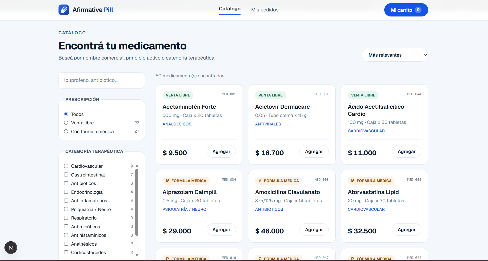
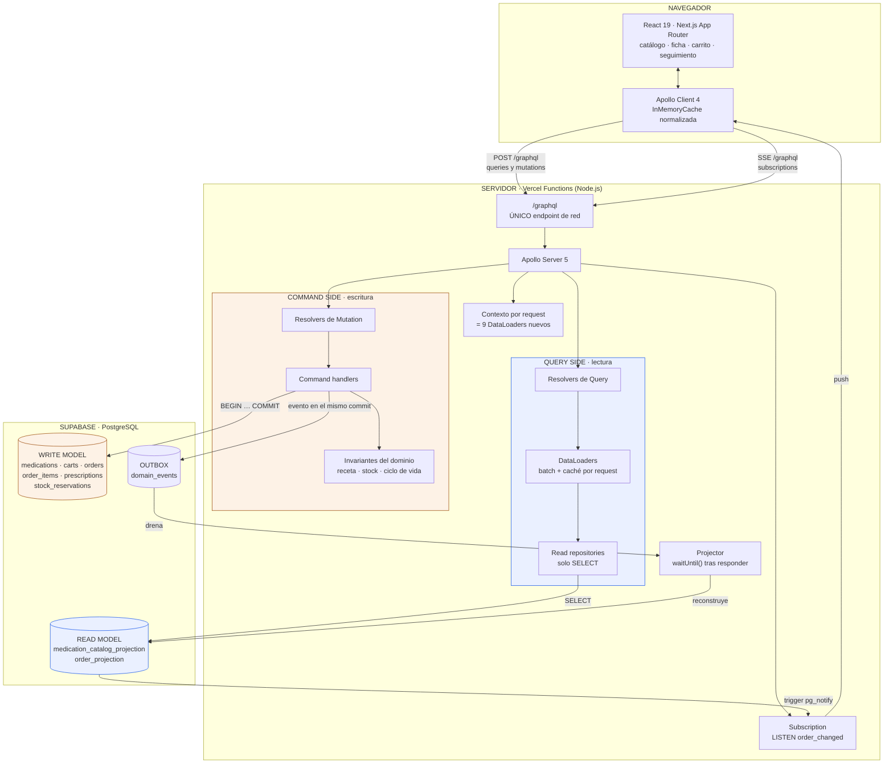

[](#)
[](#cómo-se-aplicó-cqrs)
[](#schema-graphql)
[](#stack)
[](#modelo-de-datos)
[](https://afirmative-pill.vercel.app)

# Afirmative Pill

E-commerce farmacéutico construido sobre **GraphQL + CQRS**, con Apollo Server, Next.js y
Supabase (PostgreSQL). Taller de Arquitectura de Software — el enunciado completo está en
[`docs/ENUNCIADO.md`](docs/ENUNCIADO.md).

El problema que resuelve no es vender cosas por internet: es vender **medicamentos**. Eso
impone dos reglas que el sistema no puede romper nunca — no se despacha un medicamento de
control sin fórmula médica verificada, y no se vende inventario que no existe. Toda la
arquitectura de este repositorio está ordenada alrededor de esas dos invariantes.

| | |
|---|---|
| **Aplicación en vivo** | https://afirmative-pill.vercel.app |
| **Endpoint GraphQL** | https://afirmative-pill.vercel.app/graphql |
| **Repositorio** | https://github.com/Firewallrbn/AFIRMATIVE-PILL |

### Capturas

**Inicio** — la portada presenta la farmacia y lleva al catálogo o al seguimiento de un pedido.


**Catálogo** — vista condensada (nombre, presentación, categoría y precio) con búsqueda,
filtro por fórmula médica y facetas por categoría terapéutica con su conteo.



---

## Tabla de contenido

- [Arquitectura](#arquitectura)
- [Cómo se aplicó CQRS](#cómo-se-aplicó-cqrs)
- [Cómo se mitigó el problema N+1](#cómo-se-mitigó-el-problema-n1)
- [Zero-REST](#zero-rest)
- [Consistencia eventual](#consistencia-eventual)
- [Schema GraphQL](#schema-graphql)
- [Modelo de datos](#modelo-de-datos)
- [Puesta en marcha](#puesta-en-marcha)
- [Verificación](#verificación)
- [Decisiones de diseño](#decisiones-de-diseño)
- [Estructura del repositorio](#estructura-del-repositorio)

---

## Arquitectura



**Lo que hay que leer en el diagrama**: las flechas de lectura y las de escritura nunca
tocan la misma tabla. El único puente entre los dos lados es el outbox `domain_events`, y
ese puente es asíncrono — de ahí sale toda la consistencia eventual del sistema.

### Stack

| Capa | Tecnología |
|---|---|
| Frontend | Next.js 16 (App Router), React 19, Apollo Client 4, Tailwind CSS v4 |
| Transporte | GraphQL sobre HTTP (queries/mutations) y SSE (subscriptions), ambos en `/graphql` |
| Backend | Apollo Server 5 montado como Route Handler vía `@as-integrations/next` |
| Batching | DataLoader — 9 loaders por request |
| Persistencia | Supabase PostgreSQL, driver `postgres` (postgres.js) sobre el pooler |
| Despliegue | Vercel (Fluid Compute, runtime Node.js) |

---

## Cómo se aplicó CQRS

La segregación no es conceptual: está en el árbol de carpetas, en el esquema de la base y
en el contrato GraphQL. Se puede verificar leyendo, no hay que creer en la palabra.

### Separación técnica

| | Query side | Command side |
|---|---|---|
| Carpeta | `src/server/query-side/` | `src/server/command-side/` |
| Operaciones | `Query` | `Mutation` |
| Tablas | `medication_catalog_projection`, `order_projection` | `medications`, `carts`, `orders`, `order_items`, `prescriptions`, `stock_reservations` |
| SQL permitido | solo `SELECT` | `INSERT` / `UPDATE` / `DELETE` dentro de transacciones |
| Forma de los datos | desnormalizada, una tabla por pantalla | normalizada, una tabla por concepto |

### Comandos que expresan intención, no CRUD

```graphql
createCart(patientId: ID!): CartPayload!
addMedicationToCart(input: AddMedicationToCartInput!): CartPayload!
attachPrescriptionToCart(input: AttachPrescriptionInput!): CartPayload!
placeOrder(input: PlaceOrderInput!): PlaceOrderPayload!
approveOrder(orderId: ID!): OrderPayload!
dispatchOrder(orderId: ID!): OrderPayload!
cancelOrder(orderId: ID!, reason: NonEmptyString!): OrderPayload!
```

No existe un `updateCart` ni un `saveOrder`. **Adjuntar una fórmula médica** es un acto de
negocio distinto de **agregar un medicamento**, y por eso son dos comandos: en la farmacia
real ocurren en momentos distintos y los hace gente distinta.

### Las invariantes viven en un módulo puro

[`src/server/command-side/domain/invariants.ts`](src/server/command-side/domain/invariants.ts)
no importa Postgres, ni GraphQL, ni HTTP. Solo reglas:

```ts
checkPrescription(lines, prescription)  // INVARIANTE 1 — control de fórmula médica
checkStock(lines)                       // INVARIANTE 2 — disponibilidad de inventario
canTransition(from, to)                 // ciclo de vida legal de una orden
```

Eso las hace verificables sin infraestructura:
[15 pruebas](src/server/command-side/domain/invariants.test.ts) corren con `npm test` en
un segundo, sin base de datos.

### La atomicidad es del motor, no de la aplicación

El descuento de inventario lleva la condición **dentro** del `UPDATE`:

```sql
update public.medications
   set stock = stock - $cantidad
 where id = $id
   and stock >= $cantidad     -- ← acá está la correctitud
returning stock
```

Si entre la validación y el commit otra transacción se llevó las últimas unidades, esta
sentencia afecta **0 filas** y el comando aborta con `OutOfStockError`. Dos compras
simultáneas del último medicamento no pueden ganar las dos. Los locks se toman con
`FOR UPDATE` en orden ascendente de id para que dos pedidos que compartan medicamentos no
puedan entrelazarse en un deadlock.

### Errores de negocio ≠ errores de transporte

Un medicamento agotado no es un fallo del servidor: es un resultado válido del comando. Por
eso viaja **dentro del payload**, tipado, y no en el array `errors` del protocolo:

```graphql
type PlaceOrderPayload {
  order: OrderProjection
  errors: [CommandError!]!     # interfaz con 5 implementaciones
}
```

El cliente hace `... on OutOfStockError { available }` y pinta el faltante en el campo
correcto, en vez de mostrar un "error 500" genérico.

Más detalle en [`docs/cqrs.md`](docs/cqrs.md).

---

## Cómo se mitigó el problema N+1

### El problema

La grilla del catálogo pide 20 medicamentos y, de cada uno, su categoría terapéutica:

```graphql
query CatalogoAnidado {
  medications(first: 20) {
    totalCount
    edges { node { id name price category { id name medicationCount } } }
  }
}
```

GraphQL ejecuta el resolver de `category` **una vez por medicamento** y el de
`medicationCount` **una vez por categoría devuelta**. Resolviendo cada uno por su cuenta:

```
 1  SELECT de la página
 1  SELECT del total
20  SELECT … WHERE id = $1   (categoría de cada medicamento)
20  SELECT … WHERE id = $1   (conteo de cada categoría)
───
42 consultas para pintar una grilla
```

### La solución

Los resolvers anidados no consultan la base: piden una clave a un **DataLoader**, que
acumula todas las claves del mismo tick del event loop y ejecuta **una** consulta
`WHERE id = ANY($1)`.

```ts
// src/server/query-side/resolvers.ts
MedicationSummary: {
  category: (parent, _args, ctx) => ctx.loaders.categoryById.load(parent.categoryId),
}
```

### El resultado, medido

Log real del servidor con la query de arriba:

```
[dataloader] categoryById: 11 clave(s) agrupada(s) en 1 consulta SQL
[dataloader] medicationCountByCategoryId: 11 clave(s) agrupada(s) en 1 consulta SQL
[graphql] CatalogoAnidado resuelta con 4 consulta(s) SQL
```

**42 → 4.** Y fijate en el `11`: son 20 medicamentos pero solo 11 categorías distintas. El
DataLoader además **deduplica** antes de agrupar, así que la consulta lleva 11 claves y no
20.

### Los 9 loaders

| Loader | Consulta en lote | Resuelve |
|---|---|---|
| `medicationById` | `medication_catalog_projection WHERE medication_id = ANY($1)` | `Query.medication`, ítems de una orden, ítems del carrito |
| `categoryById` | `categories WHERE id = ANY($1)` | `MedicationSummary.category`, `Medication.category` |
| `laboratoryById` | `laboratories WHERE id = ANY($1)` | `Medication.laboratory` |
| `activeIngredientById` | `active_ingredients WHERE id = ANY($1)` | `Medication.activeIngredient` |
| `medicationCountByCategoryId` | `GROUP BY category_id` | `Category.medicationCount` |
| `relatedMedications` | `row_number() OVER (PARTITION BY category_id)` | `Medication.relatedMedications` |
| `medicationsByLaboratoryId` | `row_number() OVER (PARTITION BY laboratory_id)` | `Laboratory.medications` |
| `orderById` | `order_projection WHERE order_id = ANY($1)` | `Query.order` |
| `orderHasPendingEvents` | `domain_events WHERE processed_at IS NULL` | `OrderProjection.freshness` |

### Dos detalles que son fáciles de arruinar

1. **Los loaders se crean por request**, en [`src/server/context.ts`](src/server/context.ts),
   nunca a nivel de módulo. Un loader global cachearía el stock de un medicamento entre
   pacientes distintos y terminaríamos vendiendo inventario que ya no existe. En un
   e-commerce de zapatos sería un bug; acá es un problema de salud.
2. **La función de lote devuelve un arreglo del mismo tamaño y en el mismo orden** que las
   claves recibidas. Por eso todo pasa por `indexBy`/`groupBy` y jamás se devuelve directo
   lo que vino de Postgres — Postgres no garantiza el orden y DataLoader lo exige.

### Auditoría permanente

Un plugin de Apollo Server cierra cada operación informando cuánto costó:

```
[graphql] CatalogMedications resuelta con 4 consulta(s) SQL
```

El conteo se lleva en un `AsyncLocalStorage` por request. Si alguien rompe un loader, el
número salta y se ve en el log sin tener que buscarlo.

---

## Zero-REST

El enunciado prohíbe REST en el canal de clientes. Cómo se cumple y cómo se verifica:

| Verificación | Resultado |
|---|---|
| Rutas de servidor en toda la app | **una**: `src/app/graphql/route.ts` |
| `fetch()` o `axios` fuera de Apollo en el cliente | **ninguno** |
| URL de las queries y mutations | `POST /graphql` |
| URL de las subscriptions | `POST /graphql` con `accept: text/event-stream` |

```bash
# Auditoría reproducible
find src/app -name "route.ts"                    # -> solo src/app/graphql/route.ts
grep -rn "fetch(\|axios" src/app src/components src/lib | grep -v apollo   # -> vacío
```

Dos decisiones refuerzan la restricción más allá del mínimo:

- **La ruta es `/graphql`, no `/api/graphql`.** En la pestaña Network se lee literalmente
  `POST /graphql`, sin un prefijo `/api/` que invite a preguntar si hay una API REST debajo.
- **Las subscriptions van por SSE en el mismo endpoint**, no por un WebSocket en otro
  puerto. Absolutamente todo el tráfico de la aplicación converge en una sola URL.

También en la base: las tablas tienen **RLS activa y sin políticas**, así que las claves
públicas de Supabase no pueden leer nada por PostgREST. El único camino a los datos es el
servidor GraphQL.

---

## Consistencia eventual

> *"¿Qué ve el usuario mientras la orden está siendo validada o el stock se está
> sincronizando?"* — la pregunta textual del enunciado.

La respuesta de este sistema: **ve su pedido, y ve que todavía se está consolidando.** No
se le esconde la latencia ni se le miente con un dato viejo presentado como definitivo.

### El mecanismo

```
placeOrder
  │
  ├─ BEGIN ─ descuenta stock ─ crea orden ─ inserta OrderPlaced en el outbox ─ COMMIT
  │
  ├─→ responde YA con la orden marcada freshness: SYNCING
  │
  └─→ waitUntil(drainOutbox())   ← corre DESPUÉS de la respuesta
         │
         └─ reconstruye order_projection ─ trigger pg_notify ─ push por SSE al cliente
```

### El contrato lo declara

```graphql
enum ProjectionFreshness { UP_TO_DATE  SYNCING }

type OrderProjection {
  freshness: ProjectionFreshness!   # ¿esto ya incorporó mi comando?
  version: Int!                     # cuántos eventos lleva aplicados
}
```

`freshness` se calcula preguntándole al outbox si quedan eventos sin procesar para ese
agregado — vía DataLoader, claro, así que cuesta una consulta para todas las órdenes de la
respuesta.

### Lo que ve el paciente

1. Confirma la compra → el servidor responde de inmediato con `freshness: SYNCING`.
2. La UI navega al seguimiento y muestra *"Consolidando tu pedido…"* con un indicador vivo.
3. El projector termina, emite `NOTIFY`, y la subscription empuja el estado consolidado.
4. El banner desaparece solo. Sin recargar, sin polling, sin `refetch`.

Medido en el flujo real:

```
inmediatamente después del comando:  freshness=SYNCING     version=0
a los 2.5 s:                         freshness=UP_TO_DATE  version=1
```

La variable `PROJECTION_DELAY_MS` (1200 ms por defecto) **exagera la ventana a propósito**
para que sea visible en la sustentación. En producción iría en 0 — pero la ventana existe
igual, y el diseño la contempla en vez de asumir que no está.

### Read-your-writes donde hace falta

Dos lugares se apartan de "leer solo proyecciones", y los dos están documentados donde
viven:

- **`Query.cart`** lee el write model. El carrito es el borrador privado del propio
  paciente: si agrega un medicamento tiene que verlo al instante. Proyectarlo agregaría
  latencia sin ningún beneficio.
- **`Query.order`** cae al write model *solo* mientras la proyección está atrasada, y lo
  declara devolviendo `SYNCING`. Sin ese fallback, entrar a "mi pedido" en el primer
  segundo mostraría "pedido no encontrado" justo después de haber comprado.

---

## Schema GraphQL

El contrato completo está en [`schema.graphql`](schema.graphql) (543 líneas, 51 tipos). Se
ensambla con `npm run schema` desde cuatro módulos:

| Módulo | Contenido |
|---|---|
| `src/server/schema/scalars.graphql` | `DateTime`, `Date`, `Money`, `PositiveInt`, `NonEmptyString`, `URL` |
| `src/server/schema/catalog.graphql` | catálogo, facetas, paginación (read side) |
| `src/server/schema/ordering.graphql` | carrito, órdenes, recetas, errores de comando (write side) |
| `src/server/schema/root.graphql` | `Query`, `Mutation`, `Subscription` |

### Scalars personalizados, y por qué

| Scalar | Qué impide |
|---|---|
| `Money` | Precios negativos. Normaliza el `numeric(12,2)` que Postgres entrega como string a un entero en COP. |
| `PositiveInt` | Pedir "0 unidades" o "-2 unidades". Es un error de contrato, no de negocio. |
| `NonEmptyString` | Que el registro médico de una fórmula llegue como `""` o `"   "`. |
| `URL` | Un soporte de receta que no sea una URL absoluta. |
| `Date` / `DateTime` | Que el cliente adivine el formato de fecha. |

La validación ocurre en el borde del contrato, antes de que el dominio se entere.

### Anti over-fetching: dos tipos para dos pantallas

```graphql
type MedicationSummary {        # la grilla: 9 campos
  id  sku  name  dosage  presentation  price
  requiresPrescription  inStock  category
}

type Medication {               # la ficha: todo lo anterior + clínica y relaciones
  …  stock  description
  activeIngredient  laboratory  category  relatedMedications
}
```

Pintar 50 tarjetas **no** descarga 50 fichas clínicas. En la demo se ve en la respuesta
Network: trae exactamente los campos pedidos y ninguno más.

---

## Modelo de datos

### Write model — normalizado, fuente de verdad

```
laboratories        active_ingredients      categories
        ↘                   ↓                  ↙
                     medications
                          ↑
carts ─ cart_items ────────┤
        prescriptions      │
orders ─ order_items ──────┤
        stock_reservations ┘
```

### Read model — desnormalizado, una tabla por pantalla

| Tabla | Sirve | Cómo |
|---|---|---|
| `medication_catalog_projection` | catálogo y ficha | 17 columnas planas + `search_vector tsvector` generado. Cero JOIN. |
| `order_projection` | seguimiento e historial | ítems embebidos en `jsonb`. Un `SELECT` por clave primaria resuelve la pantalla entera. |

### Outbox

`domain_events (aggregate_type, aggregate_id, event_type, payload, occurred_at, processed_at)`
con **índice parcial** sobre lo no procesado — ocupa lo que ocupa la cola pendiente (casi
siempre vacía), no la historia completa.

### Índices

- `GIN` sobre `search_vector` — búsqueda de texto en español, con acentos y raíces.
- `GIN` con `gin_trgm_ops` sobre el nombre comercial — tolerante a subcadenas y typos.
- B-tree en **todas** las claves foráneas: Postgres no las indexa solo, y son exactamente
  las columnas que los DataLoaders consultan con `= ANY($1)`.
- Índices parciales para `in_stock` y para el outbox pendiente.

Verificación de que la búsqueda entra por el índice:

```
Bitmap Index Scan on medication_catalog_search_idx
  Index Cond: (search_vector @@ '''antibiot'' & ''respiratori'''::tsquery)
Execution Time: 0.172 ms
```

### Dataset

Los 50 medicamentos provistos por el docente están en
[`db/seed/medications.csv`](db/seed/) y se normalizan en 16 laboratorios, 14 categorías
terapéuticas y 50 principios activos. 27 requieren fórmula médica, 23 son de venta libre.

---

## Puesta en marcha

### Requisitos

- Node.js 20 o superior
- Un proyecto de Supabase (PostgreSQL)

### 1. Instalar

```bash
git clone <este-repositorio>
cd AFIRMATIVE-PILL
npm install
```

### 2. Configurar el entorno

Copiar [`.env.example`](.env.example) a `.env.local` y completar:

```bash
DATABASE_URL="postgresql://postgres.<ref>:<password>@aws-0-<region>.pooler.supabase.com:6543/postgres"
DIRECT_URL="postgresql://postgres.<ref>:<password>@aws-0-<region>.pooler.supabase.com:5432/postgres"
PROJECTION_DELAY_MS=1200
LOG_LEVEL=debug
```

Las dos cadenas salen del botón **Connect** del dashboard de Supabase: `DATABASE_URL` de la
pestaña *Transaction pooler* (6543) y `DIRECT_URL` de *Session pooler* (5432).

> **Importante**: si la contraseña tiene `@ : / ? # [ ] %`, hay que codificarla en
> porcentaje (`%` → `%25`). Y el puerto 5432 tiene que ser el del **pooler de sesión**, no
> la conexión directa: la directa es IPv6 y las funciones de Vercel no la alcanzan.

### 3. Crear el esquema y cargar el dataset

```bash
npm run db:setup
```

Aplica las 5 migraciones de `db/migrations/` en orden y carga los 50 medicamentos. Es
idempotente: se puede volver a correr sobre una base ya inicializada.

### 4. Levantar

```bash
npm run dev
```

- Aplicación: http://localhost:3000
- GraphQL (Apollo Sandbox): http://localhost:3000/graphql

### Scripts

| Comando | Qué hace |
|---|---|
| `npm run dev` | Servidor de desarrollo (ensambla el SDL antes de arrancar) |
| `npm run build` | Build de producción |
| `npm run schema` | Regenera `schema.graphql` desde los módulos SDL |
| `npm run db:setup` | Migraciones + seed |
| `npm test` | Pruebas de invariantes del dominio |
| `npm run typecheck` | `tsc --noEmit` |
| `node scripts/e2e-flow.mjs` | Recorrido completo del dominio contra el servidor levantado |

### Despliegue en Vercel

```bash
vercel link
vercel env add DATABASE_URL production
vercel env add DIRECT_URL production
vercel deploy --prod
```

El proyecto se configura desde [`vercel.ts`](vercel.ts): runtime Node.js (nunca Edge — se
necesitan sockets TCP para Postgres) y `maxDuration` de 300 s para que los streams SSE de
las subscriptions no se corten.

---

## Verificación

### Pruebas de invariantes

```bash
npm test
```

15 pruebas sobre el módulo de dominio, sin base de datos: fórmula médica obligatoria, stock
exacto como caso límite, transiciones ilegales de estado, cálculo del total.

### Recorrido completo del dominio

```bash
npm run dev                    # en otra terminal
node scripts/e2e-flow.mjs
```

Ejercita los tres escenarios del enunciado contra la base real y verifica:

```
✓ rechazado con PRESCRIPTION_REQUIRED — medicamentos señalados: Alprazolam Calmpill
✓ fórmula adjunta — estado PENDING_VALIDATION
✓ orden emitida — estado PENDING_APPROVAL, freshness SYNCING
✓ la proyección alcanzó al comando: freshness=UP_TO_DATE version=1
✓ rechazado con INVALID_STATE (APPROVED → APPROVED)
✓ rechazado con OUT_OF_STOCK — pidió 166, había 116
✓ devolvió la MISMA orden, no creó una nueva
```

### Evidencia del batching

Con `LOG_LEVEL=debug`, cada lote y cada operación quedan en la consola del servidor:

```
[dataloader] categoryById: 11 clave(s) agrupada(s) en 1 consulta SQL
[graphql] CatalogMedications resuelta con 4 consulta(s) SQL
```

---

## Decisiones de diseño

| Decisión | Por qué |
|---|---|
| **Monolito modular**, no federación | El enunciado permite ambas. La separación por bounded context ya existe en `src/server/` (`query-side`, `command-side`) y puede extraerse a subgraphs sin tocar el contrato. La federación agregaba dos procesos y riesgo sin agregar aprendizaje. |
| **Una sola app Next.js** | Un solo despliegue, sin CORS, sin dos URLs. Frontend (`src/app/`) y backend (`src/server/`) siguen estrictamente separados por carpeta; la única superficie de contacto es `src/app/graphql/route.ts`. |
| **`postgres.js` y no `supabase-js`** | `supabase-js` habla PostgREST por debajo, lo que complicaría demostrar batching real y transacciones. Con SQL directo tenemos `= ANY($1)` para los DataLoaders y `BEGIN/COMMIT` para el comando de compra. |
| **SSE y no WebSocket** para subscriptions | Va por el mismo `/graphql`, es nativo en funciones serverless y no depende de la API experimental de upgrade de Vercel. El contrato `type Subscription` es idéntico. |
| **Outbox y no Event Sourcing completo** | El taller evalúa la segregación y el manejo de la consistencia eventual, no el event store. El outbox da consistencia eventual real y observable sin el costo de reconstruir estado desde eventos. |
| **Transacción en TypeScript y no en PL/pgSQL** | Las invariantes quedan en un módulo de dominio testeable sin base de datos, en vez de repartidas entre SQL y aplicación. La atomicidad es la misma: vive en el `UPDATE … WHERE stock >= cantidad`. |
| **Carrito como agregado del servidor** | El enunciado nombra "creación de carritos" y "adición de medicamentos" como comandos de dominio. Guardarlo en el navegador habría creado dos verdades y ninguna confiable. |
| **`prepare: false` en el driver** | Obligatorio con el pooler en modo transacción: la conexión se reparte entre requests y los prepared statements con nombre se pierden. |
| **RLS activa sin políticas** | Deny-all deliberado. El acceso es exclusivamente por el servidor GraphQL con rol privilegiado; las claves públicas de Supabase no leen nada. Esto aparece como aviso INFO en el linter de Supabase y es intencional. |

---

## Estructura del repositorio

```
AFIRMATIVE-PILL/
├── schema.graphql                  ← contrato completo (generado)
├── db/
│   ├── migrations/                 ← 5 migraciones versionadas
│   └── seed/                       ← dataset de 50 medicamentos
├── docs/
│   ├── ENUNCIADO.md                ← enunciado del taller
│   ├── PLAN.md                     ← plan de trabajo y bitácora de decisiones
│   ├── capturas/                   ← capturas de la aplicación
│   └── cqrs.md                     ← comandos, eventos, proyecciones
├── scripts/
│   ├── build-schema.mjs            ← ensambla el SDL
│   ├── db-setup.mts                ← migraciones + seed
│   └── e2e-flow.mjs                ← recorrido del dominio
└── src/
    ├── app/                        ← FRONTEND (+ la única ruta de red)
    │   ├── page.tsx                    catálogo
    │   ├── medicamentos/[id]/          ficha técnica
    │   ├── carrito/                    carrito y fórmula médica
    │   ├── ordenes/                    historial y seguimiento
    │   └── graphql/route.ts        ← ÚNICO ENDPOINT DE RED
    ├── components/                 ← UI
    ├── lib/apollo/                 ← ApolloProvider, links, typePolicies
    ├── graphql/operations.ts       ← todas las operaciones del cliente
    └── server/                     ← BACKEND
        ├── schema/                     SDL modular + scalars
        ├── loaders/                    los 9 DataLoaders
        ├── query-side/             ← LECTURA (solo SELECT)
        ├── command-side/           ← ESCRITURA (comandos + invariantes)
        ├── projections/                projector del outbox
        └── subscriptions/              LISTEN/NOTIFY → SSE
```

---

## Evolución futura

Lo que haría falta para llevar esto a producción de verdad, y que quedó deliberadamente
fuera del alcance del taller:

- **Autenticación real.** Hoy el `patientId` llega por cabecera. Correspondería un `login`
  como mutación de GraphQL (nunca un endpoint REST) emitiendo un JWT que el contexto
  verifique, con políticas RLS por paciente.
- **Federación.** `catalog` y `ordering` ya son bounded contexts separados; extraerlos a dos
  subgraphs detrás de un Router es mecánico.
- **Projector como worker dedicado.** Hoy corre con `waitUntil` tras cada comando. Con
  volumen real correspondería un consumidor independiente sobre una cola.
- **Persistencia del soporte de receta.** Hoy se guarda la URL del documento; faltaría
  subirlo a almacenamiento y verificarlo contra el registro del profesional.
