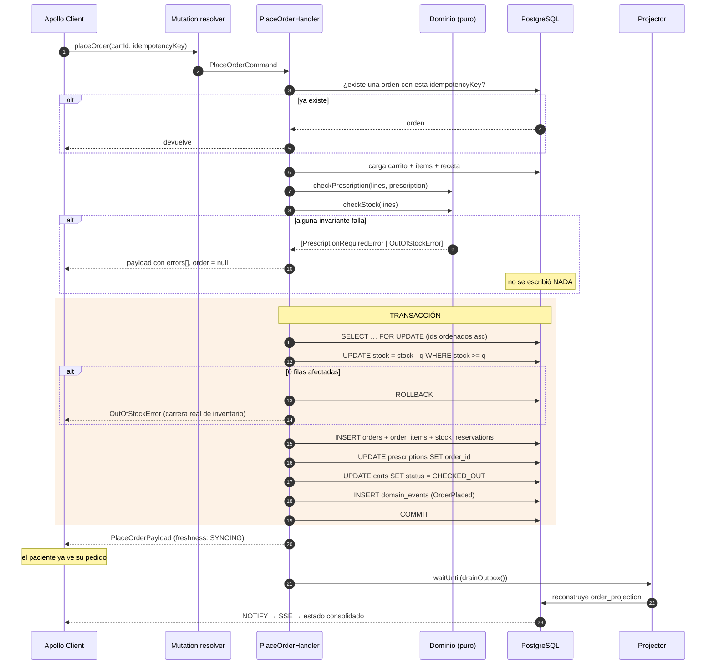

# CQRS en Afirmative Pill

Documento de profundización. El resumen ejecutivo está en el
[README](../README.md#cómo-se-aplicó-cqrs); acá está el detalle de cada pieza, las
decisiones que no son obvias y las excepciones que tomamos a propósito.

---

## 1. Por qué CQRS acá y no en cualquier lado

CQRS no es gratis: duplica el modelo de datos y trae consistencia eventual, que es un
problema que antes no existía. Se paga ese precio cuando lectura y escritura tienen
**formas y cargas genuinamente distintas**, y este dominio es un caso de manual:

| | Lectura | Escritura |
|---|---|---|
| Operación típica | buscar "antibiótico para infección respiratoria" | emitir un pedido con 3 ítems |
| Frecuencia | altísima, cada tecla del buscador | baja, una por compra |
| Forma natural del dato | una fila plana con todo para pintar una tarjeta | un grafo normalizado de 6 tablas |
| Qué necesita | velocidad e índices de texto | atomicidad e invariantes |
| Qué pasa si sale mal | el usuario ve un catálogo desactualizado un segundo | se despacha un medicamento que no existe |

Forzar los dos usos sobre el mismo modelo obliga a elegir: o se normaliza (y cada búsqueda
paga 4 JOIN) o se desnormaliza (y cada compra pelea con datos duplicados). CQRS deja de
elegir: cada lado tiene el modelo que le sirve.

---

## 2. El camino de escritura, paso a paso

### `placeOrder` — el comando crítico



### Las tres cosas que hacen que esto sea correcto y no solo "que funcione"

**1. El evento va en la misma transacción que el estado.**
Es el patrón *transactional outbox*. Si el commit falla no hay evento; si pasa, el evento
existe. Es imposible que quede una orden sin su evento (proyección que nunca se actualiza)
o un evento sin su orden (proyección de algo que no ocurrió). La alternativa —publicar a
una cola después del commit— tiene una ventana donde el proceso puede morir entre las dos
cosas.

**2. La condición de stock vive dentro del UPDATE.**

```sql
update public.medications
   set stock = stock - $cantidad
 where id = $id and stock >= $cantidad
```

La validación previa de `checkStock` es **UX**: permite devolver todos los faltantes de una
vez en lugar de que el paciente los descubra de a uno. La **correctitud** está acá: entre
esa validación y el commit pueden pasar milisegundos en los que otra transacción se lleve
las últimas unidades. Si eso ocurre, el UPDATE afecta 0 filas y el comando aborta.

**3. Los locks se toman en orden ascendente de id.**

```ts
const ids = lines.map(l => Number(l.medicationId)).sort((a, b) => a - b);
await tx`select id from public.medications where id = any(${ids}) order by id for update`;
```

Dos pedidos que compartan los medicamentos 7 y 12 los bloquean siempre en el mismo orden
(7, después 12). Sin esto, un pedido podría tomar 7 y esperar 12 mientras el otro tiene 12
y espera 7 — deadlock clásico, y Postgres mataría una de las dos transacciones al azar.

### Idempotencia

`orders.idempotency_key` tiene índice único y el cliente genera la clave una vez por
intento de compra (vive en un `useRef`, no en estado). Un doble clic, un reintento del
navegador o un retry de red reenvían la **misma** clave, y el handler devuelve la orden que
ya creó. En un e-commerce común esto evita un cargo duplicado; acá evita una doble
dispensación de un medicamento controlado.

---

## 3. El camino de lectura

### La regla y cómo se hace cumplir

`src/server/query-side/` solo contiene `SELECT`, y solo sobre `medication_catalog_projection`,
`order_projection` y las tablas de referencia. La regla se hace cumplir por construcción:

- los repositorios de lectura solo exponen métodos que leen;
- el módulo no importa nada de `command-side/`;
- las proyecciones son tablas distintas de las del write model, así que "tocar sin querer"
  el modelo transaccional requeriría escribir el nombre de otra tabla.

### Qué gana el read side

La pantalla de seguimiento de un pedido se resuelve así:

```sql
select order_id, patient_id, status, total, items, prescription_status, …
from public.order_projection
where order_id = $1
```

Un `SELECT` por clave primaria. Los ítems vienen embebidos en `jsonb`. **Cero JOIN** contra
`orders`, `order_items`, `medications` o `prescriptions`. La versión normalizada de esa
misma pantalla necesitaría cuatro JOIN y una agregación.

### Las dos excepciones, y por qué son correctas

| Excepción | Dónde | Razón |
|---|---|---|
| `Query.cart` lee el write model | `command-side/resolvers.ts` | El carrito es el borrador privado del propio paciente y exige *read-your-writes*: si agrego un medicamento tengo que verlo ya. Proyectarlo agregaría latencia a cambio de nada. No tiene lectores concurrentes ni carga de consulta. |
| `Query.order` cae al write model mientras la proyección está atrasada | `query-side/read-repositories/order-read-repository.ts` | Sin esto, entrar a "mi pedido" en el primer segundo devolvería `null` — "pedido no encontrado" justo después de comprar. El fallback devuelve el dato real marcado `SYNCING`. |

Las dos están escritas donde se usan, con el razonamiento al lado. Una excepción escondida
es deuda; una excepción documentada es una decisión.

---

## 4. El outbox y el projector

### Tabla

```sql
domain_events (
  id, aggregate_type, aggregate_id, event_type, payload jsonb,
  occurred_at, processed_at
)
```

Con índice **parcial** sobre lo pendiente:

```sql
create index domain_events_unprocessed_idx
  on public.domain_events (id) where processed_at is null;
```

El índice ocupa lo que ocupa la cola (casi siempre vacía), no la historia completa de
eventos del sistema.

### Eventos del dominio

| Evento | Lo emite | Efecto en el read model |
|---|---|---|
| `CartCreated` | `createCart` | ninguno (el carrito no se proyecta) |
| `MedicationAddedToCart` | `addMedicationToCart` | ninguno |
| `PrescriptionAttached` | `attachPrescriptionToCart` | ninguno |
| `OrderPlaced` | `placeOrder` | crea `order_projection` + refresca stock del catálogo |
| `OrderApproved` | `approveOrder` | actualiza estado y `prescription_status` |
| `OrderDispatched` | `dispatchOrder` | actualiza estado |
| `OrderCancelled` | `cancelOrder` | actualiza estado + devuelve stock al catálogo |

### Cómo corre el projector sin un proceso residente

En serverless no hay dónde poner un worker que viva para siempre. Tres mecanismos cubren
el hueco:

1. **`waitUntil(drainOutbox())`** después de cada comando. La función Fluid sigue viva lo
   necesario para drenar, pero la respuesta HTTP ya salió: el paciente no espera.
2. **Drenado perezoso en la lectura**: si `Query.order` detecta eventos pendientes, dispara
   el projector en segundo plano. Si una instancia se congeló a mitad de camino, la
   siguiente lectura pone la proyección al día.
3. **`for update skip locked`** al tomar el lote. Dos instancias pueden drenar a la vez sin
   pisarse: cada una toma eventos distintos en lugar de bloquearse o duplicar trabajo.

### El projector es idempotente

Reconstruye la proyección **completa** desde el write model en vez de aplicar deltas:

```sql
insert into public.order_projection (…)
select … from public.orders o
  left join public.order_items oi …
where o.id = $1
on conflict (order_id) do update set … projection_version = projection_version + 1
```

Reprocesar el mismo evento dos veces no corrompe nada — solo incrementa `projection_version`
de más. Con entrega *al menos una vez*, eso es exactamente la propiedad que se necesita.

---

## 5. Consistencia eventual, en concreto

### La ventana

```
t=0ms      COMMIT del comando          → el write model ya es verdad
t=0ms      respuesta al cliente        → freshness: SYNCING
t=1200ms   el projector arranca        → PROJECTION_DELAY_MS
t=1290ms   order_projection escrita    → freshness: UP_TO_DATE
t=1291ms   NOTIFY → SSE → cliente      → la UI se actualiza sola
```

`PROJECTION_DELAY_MS` es un retardo artificial para que la ventana sea **visible** en la
sustentación. En producción iría en 0, pero la ventana seguiría existiendo (la latencia
real de la reconstrucción); el diseño no asume que sea cero.

### Cómo lo comunica el contrato

```graphql
enum ProjectionFreshness { UP_TO_DATE  SYNCING }
```

`freshness` no es un campo cosmético: se calcula preguntándole al outbox si quedan eventos
sin procesar para ese agregado. Si los hay, lo que estamos devolviendo es una foto anterior
al último comando, y el contrato lo dice en vez de esconderlo.

`version` (el `projection_version` de la tabla) permite además detectar si dos lecturas
sucesivas avanzaron.

### Tres estrategias que descartamos

| Alternativa | Por qué no |
|---|---|
| Esperar al projector antes de responder | Convierte la consistencia eventual en fuerte y tira a la basura el desacoplamiento. El paciente esperaría la proyección para ver su propia compra. |
| Devolver `null` mientras no haya proyección | Técnicamente correcto, pésimo: "pedido no encontrado" justo después de comprar un medicamento. |
| Polling desde el cliente | Funciona, pero desperdicia requests y el enunciado valora explícitamente las Subscriptions. Con SSE el servidor avisa cuando hay algo que avisar. |

### Qué NO es eventualmente consistente

Vale marcarlo porque es donde la gente suele equivocarse: **el descuento de stock no es
eventual**. Ocurre dentro de la transacción del comando, de forma inmediata y atómica. Lo
eventual es la **proyección** de ese stock en el catálogo — el paciente puede ver "120
disponibles" durante un segundo cuando ya quedan 118. Eso es aceptable para pintar una
grilla, y deja de serlo en el momento de comprar, que es justo cuando el `UPDATE … WHERE
stock >= cantidad` vuelve a mandar.

---

## 6. Mapa de archivos

| Concepto | Archivo |
|---|---|
| Invariantes del dominio | `src/server/command-side/domain/invariants.ts` |
| Pruebas de las invariantes | `src/server/command-side/domain/invariants.test.ts` |
| Comando de compra | `src/server/command-side/handlers/place-order.ts` |
| Ciclo de vida de la orden | `src/server/command-side/handlers/order-lifecycle.ts` |
| Escrituras del carrito | `src/server/command-side/write-repositories/cart-write-repository.ts` |
| Resolvers de comando | `src/server/command-side/resolvers.ts` |
| Repositorios de lectura | `src/server/query-side/read-repositories/` |
| Resolvers de lectura | `src/server/query-side/resolvers.ts` |
| Projector | `src/server/projections/projector.ts` |
| Subscriptions | `src/server/subscriptions/order-status.ts` |
| Outbox y proyecciones (DDL) | `db/migrations/003_events.sql`, `004_projections.sql` |
